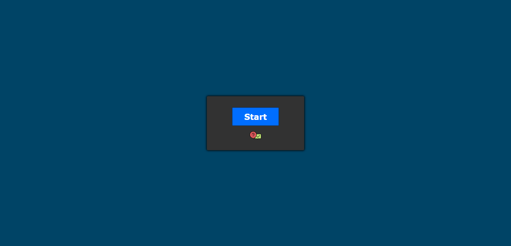

<h1 align="center">
  
    QUIZ GAME
      
</h1>

<h4>
  Eu desenvolvi esse QUIZ para uma aula chamada de LTT, onde eu tinha que fazer um seminário
  sobre tipos de redação técnica e ao final da apresentação, eu tinha que criar 
  algum tipo de dinâmica sobre a redação. Então criei esse QUIZ GAME como
  dinâmica.
    
  Caso queira ver o PowerPoint do que eu fiz para apresentar só <a href="Apresentação%20Redação%20Técnica.ppsx">clicar aqui</a>
</h4>
 

<h3 align="center">
  
</h3>

 

<h2>
    💻 Tecnologias
</h2>

Tecnologias usadas para resolver o problema:

<ul>
  <li><a href="Jogo%20Quiz/js/script.js">Javascript</a></li>
</ul>

 

<h2>
    🤔 Como Executar 
</h2>

<h4>Clonando o projeto</h4>

<pre>
git clone https://github.com/Vitor-Carmo/Quiz-Game.git
</pre>

<h4>
E execute o arquivo <code><a href="Jogo%20Quiz/index.html">index.html</a></code>
</h4>

  

 
